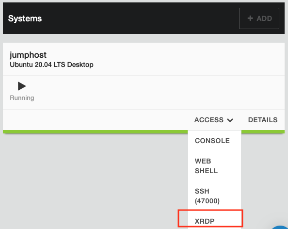
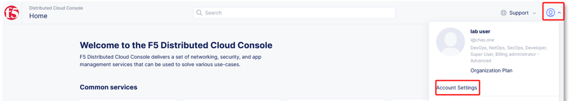
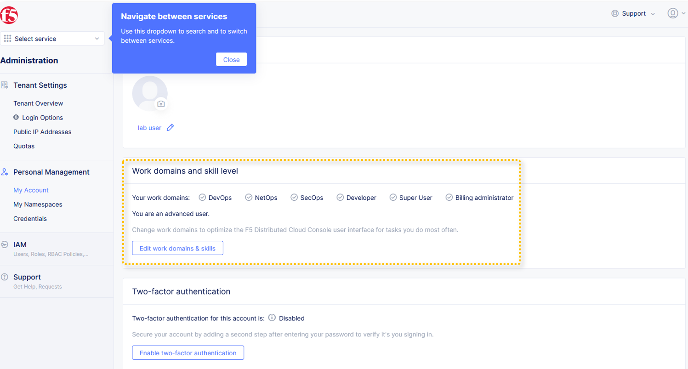
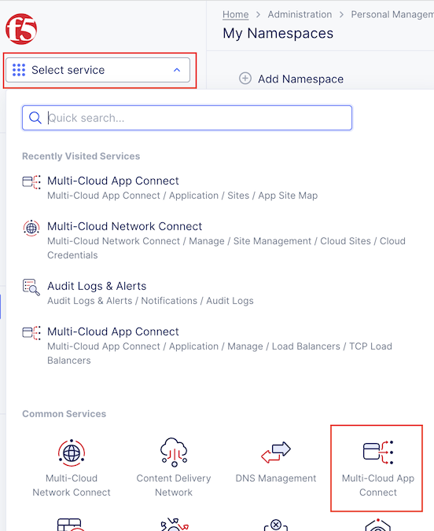
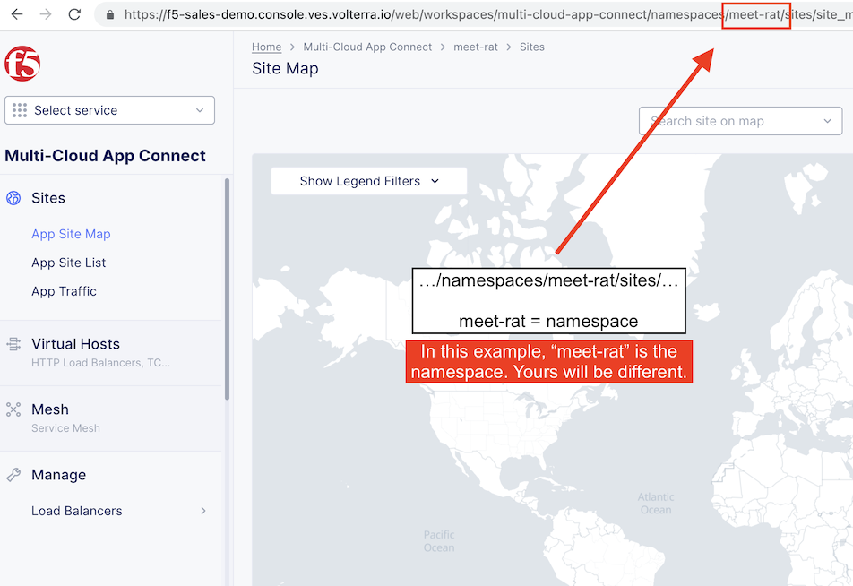

Lab 1: Explore F5 Distributed Cloud Console
===========================================

.. contents:: Table of Contents

In this lab you will launch the UDF Blueprint and setup your initial F5 XC login credentials.

Launch UDF
##########

1. Open the UDF Blueprint "F5XC TechXchange 2023 MCN Lab" https://udf.f5.com/b/ee3fbeab-9756-48c4-a45e-dfd7794357b4 and click "Deploy" to create a deployment. Then hit "Start".

> *Once you start the UDF deployment, it will create an ephemeral account on the F5 Distributed Cloud console (this may take 5-10 min). Then you will receive an email to update your password.*

2. Click the link in the email to change your password.

3. Then use tenant "f5-sales-demo" to login and accept terms.

Log into the XC Console
#######################

Run the following steps from the UDF jumphost. Tools like Terraform are already installed.

1. Access the UDF jumphost via xRDP desktop session.

======  ========
User    Password
======  ========
ubuntu  HelloUDF
======  ========

2. Log into your assigned XC tenant - https://f5-sales-demo.console.ves.volterra.io

3. When you first login you will need to select your "persona". Select all options and level as "Advanced".

4. Several tooltips will appear. You can close these out.

5. Click on "Account Settings" by expanding the "Account" icon in the top right of the screen and clicking on "Account Settings".

> *For the purposes of this lab, permissions have been restricted to lab operations. As a result, some menus will be locked and not visible.*

6. In the resulting window you can observe the **Work domains and skill level** section and other administrative functions.

Namespaces, which provide an environment for isolating configured applications or enforcing role-based access controls, are leveraged within the F5 XC Console.

> *For the purposes of this lab, each lab attendee has been provided a unique namespace which you will be defaulted to (in terms of GUI navigation) for all tasks performed through the course of this lab.*

7. Click on the **Select Service** in the left-hand navigation. In the resulting fly out navigation, click **Multi-Cloud App Connect**.

8. In the **Multi-Cloud App Connect** configuration screen observe the URL. In the URI path, locate the **\<adjective-animal\>** namespace that you have been assigned. It will be located in the portion of the URI path between */namespaces/* and */sites/* as shown in this example **…/namespaces/\<namespace\>/sites/…**. Note the namespace as it will be used throughout the remaining lab tasks.

> *Administratively, there are other ways to find namespaces. Due to access and permission restrictions for this particular lab, those menus are not available.*

Next Steps
##########

- `Lab 2: Customize Lab Environment <lab2.rst>`_
