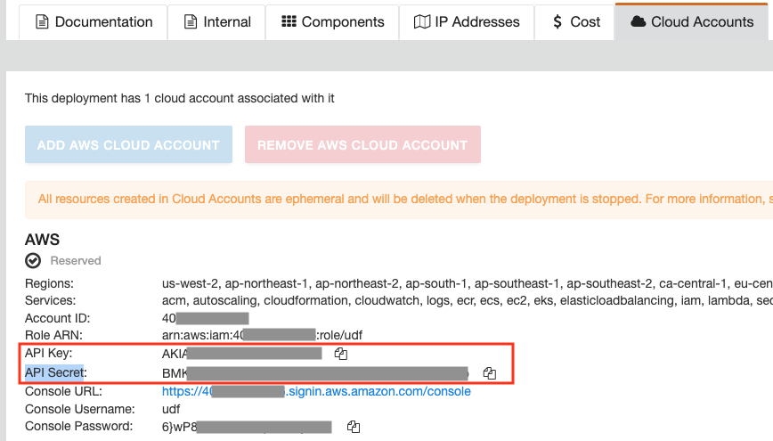

Lab 2: Customize Lab Environment
================================

.. contents:: Table of Contents

In this lab you will customize the Terraform environment by cloning the GitHub repository and populating the Terraform TFVARS file.

Clone Repository and Update Terraform
#####################################

1. Open a terminal on the jumphost. Clone the lab repository and change into the directory.

.. code:: bash

     git clone https://github.com/f5devcentral/f5xc-mcn-TechXchange.git
     cd f5xc-mcn-TechXchange/

2. Copy the tfvars file.

.. code:: bash

     cp admin.auto.tfvars.example admin.auto.tfvars

3. Edit the file using "vi" in the terminal so you can customize the parameter values for your lab like owner, keys, and zone. You will retrieve the values in the following steps. 

.. code:: bash

     vi admin.auto.tfvars

     # Editing Tips
     # 1. type "i" for insert
     # 2. hit "ESC" key to quit editing mode
     # 3. hold shift + ZZ to save

     # Example Values
     # owner          = "lastname"
     # api_url        = "https://f5-sales-demo.console.ves.volterra.io/api"
     # api_p12_file   = "/home/ubuntu/Downloads/f5-sales-demo.console.ves.volterra.io.api-creds.p12"
     # aws_access_key = "accesskeyxxxx"
     # aws_secret_key = "secretxxxx"
     # zone_name      = "your.domain.com"

4. Open the `Arcadia DNS Tool <https://tool.xc-mcn.securelab.online>`_ and copy your Zone Name. Paste the value in the tfvars file for "zone_name".

> *Note: We will use a tool to generate a domain entry for lab purposes (Arcadia DNS)*.

.. figure:: ../assets/xc/zone_name.png

5. On the UDF deployment page, click the "Cloud Accounts" tab and copy the values for "API Key" and "API Secret". Paste the values in the tfvars file for "aws_access_key" and "aws_secret_key". The AWS Access Key and the Secret Key can be used to create the **AWS Programmatic Access Credentials** on F5 Distributed Cloud Console. See `AWS Cloud Credentials <https://docs.cloud.f5.com/docs/how-to/site-management/cloud-credentials#aws-programmable-access-credentials>`_  for more information.

6. Using a jumphost web browser, open the XC Console https://f5-sales-demo.console.ves.volterra.io and click **Administration** tab.

.. figure:: ../assets/xc/administration.png

7. Open **Credentials** section and click **Add Credentials**.

.. figure:: ../assets/xc/create_credentials.png

8. Fill in the details and download your credentials file. Remember the "Password" as it will be used for **VES_P12_PASSWORD** in the next step.

> *The p12 file will download to /home/ubuntu/Downloads/f5-sales-demo.console.ves.volterra.io.api-creds.p12 and is used in tfvars as the value for "api_p12_file". DO NOT change the path! If you do, then you will need to make sure the tfvars value matches too!*

.. figure:: ../assets/xc/fill_credentials.png

9. Return to the jumphost terminal. Save the tfvars file and exit "vi" mode.

.. code:: bash

     # Editing Tips
     # 1. hit "ESC" key to quit editing mode
     # 2. hold shift + ZZ to save

Set Terminal Environment Variables
##################################

1. Create **VES_P12_PASSWORD** environment variable with the password from the previous "API Credentials" step.

> *Note: Keep the terminal window open. If you close it, you will need to export the VES_P12_PASSWORD environment variable again.*

.. code:: bash

     export VES_P12_PASSWORD=your_certificate_password

Next Steps
##########

- `Module 1: Front-end Portal Deployed in Cloud A <../module1>`_
