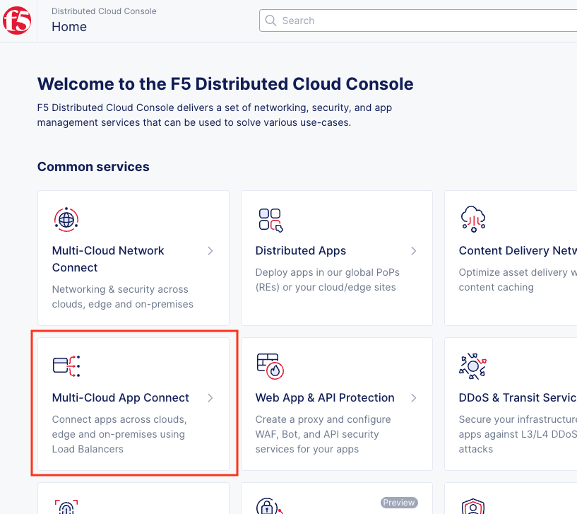
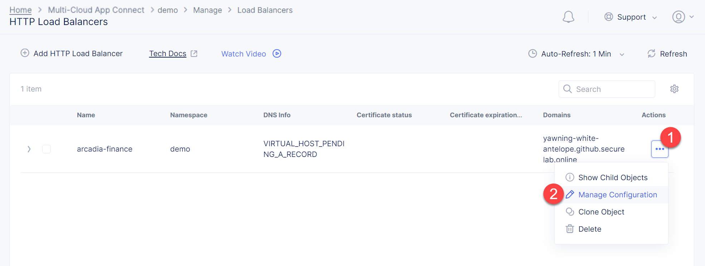
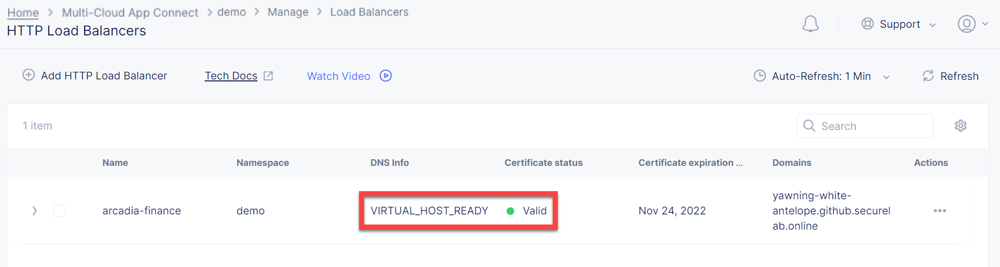
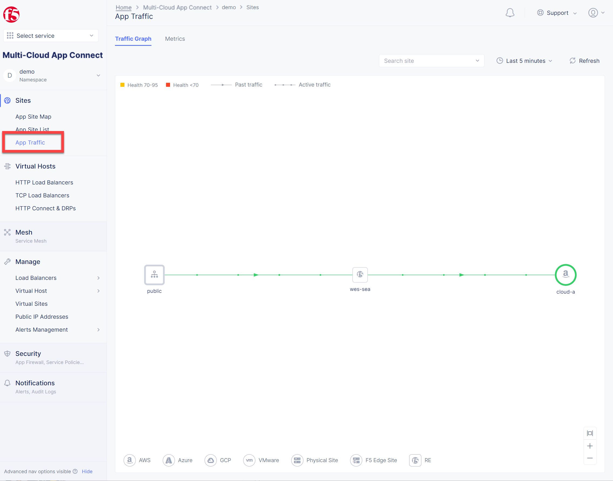
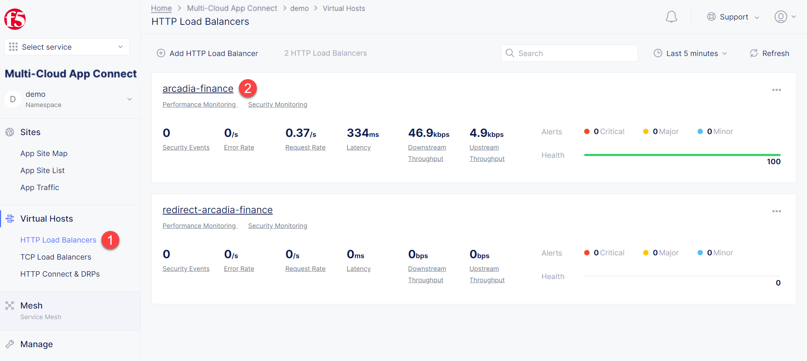
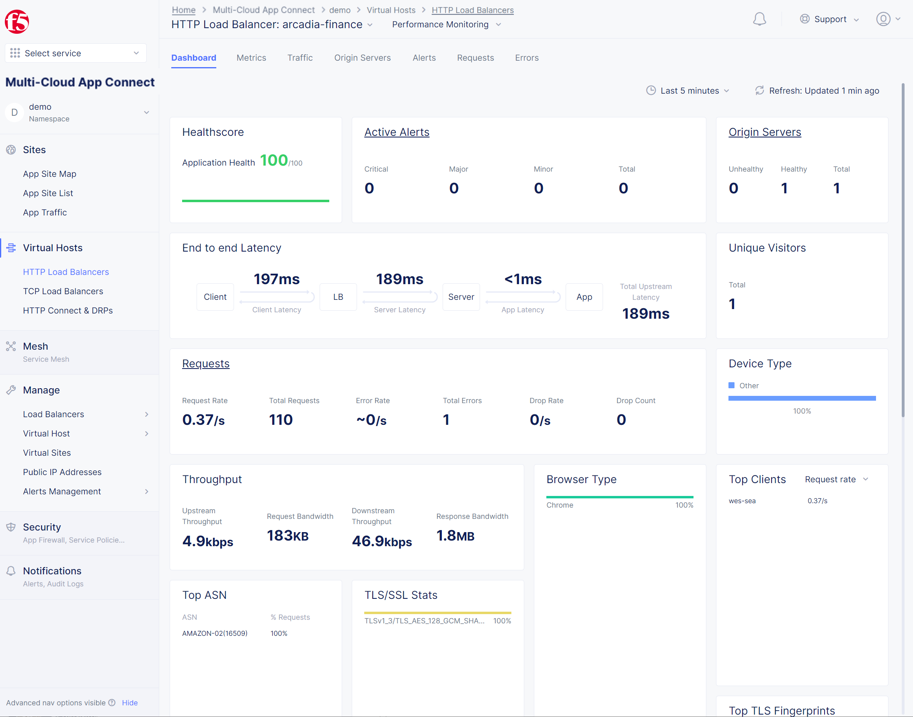

Lab 2: Create Front-end Portal in Cloud A
=========================================

.. contents:: Table of Contents

In this lab we use F5 XC to configure HTTP Load Balancer resources for the front-end. This use case supposes SSL offloading, the process of removing the SSL-based encryption from incoming traffic to relieve a web server of the processing burden of decrypting and/or encrypting traffic sent via SSL.

> *Note: We will use a tool to generate a domain entry for lab purposes (Arcadia DNS)*

.. figure:: ../assets/ssl-offload.png

Create HTTP LB
~~~~~~~~~~~~~~~

Next set up the HTTP Load Balancer.

1. In the F5 Distributed Cloud Console navigate to the **Multi-Cloud App Connect** service in the service menu.

2. Select **HTTP Load Balancers**. Then click the **Add HTTP Load Balancer** button to open the form of HTTP Load Balancer creation.

.. figure:: ../assets/create_cloud_a_lb.png

3. Give it a name. For this demo we will use **arcadia-finance**.

.. figure:: ../assets/cloud_a_lb_metadata.png

4. Next we need to provide a domain name for our workload: a domain can be delegated to F5, so that Domain Name Service (DNS) entries can be created quickly in order to deploy and route traffic to our workload within seconds. In this demo we use the domain name supplied by the Arcadia DNS tool which is unique for each lab student (ex. **"yawning-white-antelope.github.securelab.online"**). Then check off the boxes to redirect HTTP to HTTPS, and add HSTS Header.

.. figure:: ../assets/cloud_a_lb_domains.png

5. After that let's create a new origin pool, which will be used in our load balancer. The origin pools are a mechanism to configure a set of endpoints grouped together into a resource pool that is used in the load balancer configuration. Click **Add Item** to open the pool creation form.

.. figure:: ../assets/cloud_a_lb_origins.png

6. Then open the drop-down menu and click **Create new Origin Pool**.

.. figure:: ../assets/cloud_a_lb_create_origin.png

7. To configure the origin pool we'll add a pool name, followed by a set of config options for the pool. First, let's give this pool a name. Next we need to configure the port (the end point service/workload available on this port). In this demo it's Port **80**. And now click **Add Item** to start configuring an origin server.

.. figure:: ../assets/cloud_a_lb_origin_details.png

8. Let's now configure origin server. First open the drop-down menu to specify the type of origin server. For this demo select **IP address of Origin Server on given Sites**. Then specify IP - **10.0.20.100** for this demo. After that we need to select **Site** as Site type and specify it as **cloud-a**. Finally, the last step to configure the origin server is specifying network on the site. Select **Inside Network**. Complete by clicking **Add Item**.

.. figure:: ../assets/cloud_a_lb_origin_server.png

9. Then just click **Continue** to move on.

.. figure:: ../assets/cloud_a_lb_origin_details_save.png

10. Once done, click **Add Item** to apply the origin pool to the load balancer configuration. This will return to the load balancer configuration form.

.. figure:: ../assets/cloud_a_lb_origin_save.png

11. Take a look at the load balancer configuration and finish creating it by clicking **Save and Exit**.

.. figure:: ../assets/cloud_a_lb_save.png

Update DNS
~~~~~~~~~~~~

You will see the created HTTP Load Balancer. Now we need to copy the host name in order to delegate the domain.

1. Open the menu of HTTP Load Balancer we've just created and select **Manage Configuration**.  

2. Copy host name you see in the configuration. Host name will be used as CNAME value for the domain. After copying the host name, move on and copy CNAME value. It will be used to create an HTTPS certificate. 

.. figure:: ../assets/cloud_a_lb_dns_details.png

3. Open `Arcadia DNS Tool <https://tool.xc-mcn.securelab.online>`_ and paste the host name as **CNAME record** and the CNAME value as **ACME_CHALLENGE record**. Then click **Update** to update DNS and create the certificate. 

.. figure:: ../assets/cloud_a_lb_tool_update.png

4. Check the status in the XC Console. It may take a few minutes to update the DNS info and generate and apply the certificate. You will see their updated status as below:

Test Application
~~~~~~~~~~~~~~~~~

Now that the DNS is updated and the certificate is active, let's proceed to the website and test.

1. Go to **yawning-white-antelope.github.securelab.online** and see if the certificate of the site is valid. 

Note: your FQDN will be different!

.. figure:: ../assets/cloud_a_lb_website.png

2. Let's now log in. Use the following credentials:

======  =========
User    Password
======  =========
admin   iloveblue
======  =========

.. figure:: ../assets/cloud_a_lb_website_login.png

After we enter the website, we can see it's up and running. We can also see that there are a few modules that are still not active - Refer a friend and Transactions. We will configure them in the following steps.

.. figure:: ../assets/cloud_a_lb_website_sections.png

3. Next let's navigate to the XC Console **App Traffic** to see the current traffic flow. It shows us traffic coming from clients to Cloud A through F5 PoP with SSL offloading which provides security and speed.  

4. And finally, let's take a look at the HTTP Load Balancer dashboard. Proceed to **HTTP Load Balancers** and then click on the created one. 

We can see a view for entire performance monitoring information. Dashboard shows sections such as healthscore, active alerts, metrics, clients, devices, policy, security, etc. Metrics include requests, throughputs, and latency. Client information includes details such as top clients, TLS fingerprints, client location, etc.
Device information includes device type and browser type. 

Next Steps
##########

- `Module 2: Back-end Service via HTTP LB (Layer 7) in Cloud B <../module2>`_
