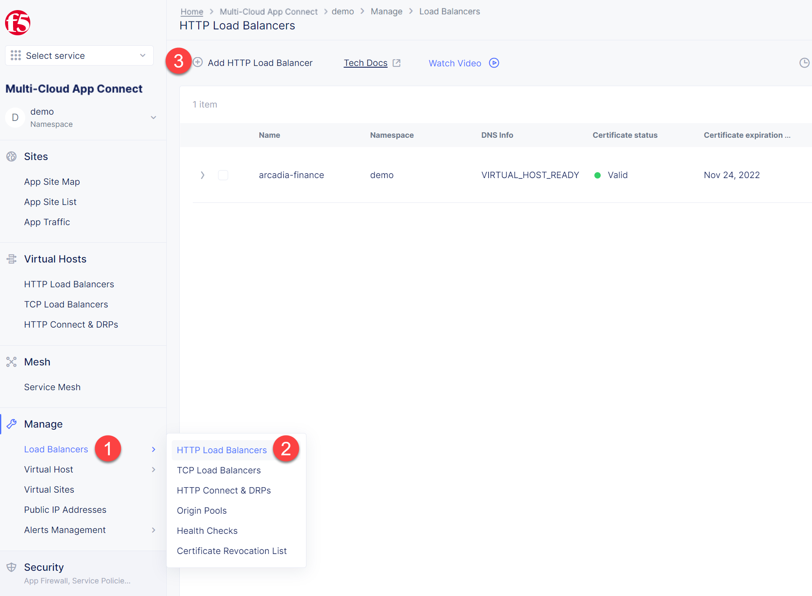

Lab 2: Create Back-end HTTP LB in Cloud A
=========================================

.. contents:: Table of Contents

In this lab we will create another HTTP Load Balancer (Layer 7) and make it available on the Arcadia Finance website, which was previously inactive in the earlier testing. 

Below is the service topology we will achieve at the end of this module. Note the IP overlap of the Core Module IP (deployed in the previous lab), and the IP of the Refer-a-Friend service (also 10.0.20.100). This is a perfect opportunity to use an HTTP Load Balancer!

.. figure:: ../assets/layer-7.png

Create HTTP LB
##############

Assuming you now have your Cloud B confirmed, let's create one more HTTP Load Balancer for this use case.

1. Navigate to **Multi-Cloud App Connect** and select **HTTP Load Balancers**. Then click the **Add HTTP Load Balancer** button to open the form of HTTP Load Balancer creation.

2. Give this Load Balancer a name. For this use case we will use **friends-module**.

.. figure:: ../assets/cloud_b_lb_metadata.png

3. Now we need to provide a domain name for our workload. In this use case we will specify **friends.yawning-white-antelope.github.securelab.online**. Then open the drop-down menu to select Load Balancer type - **HTTP** and uncheck the box to disable automatic managing of DNS records. Next we need to specify the port. We will use Port **80** for this use case. 

Note: your FQDN will be different!

.. figure:: ../assets/cloud_b_lb_dns.png

4. After that let's create a new origin pool, which will be used in our load balancer. Click **Add Item** to open the pool creation form.

.. figure:: ../assets/cloud_b_lb_pool_add.png

5. Then open the drop-down menu and click **Create new Origin Pool**.

.. figure:: ../assets/cloud_b_lb_origin_create.png

6. To configure the origin pool we'll add a pool name, followed by a set of config options for the pool. First, let's give this pool a name - **friends-origin**. Next we need to configure the port - **80**. And then click **Add Item** to start configuring an origin server.

.. figure:: ../assets/cloud_b_lb_origin_meta.png

7. First open the drop-down menu to specify the type of origin server. For this use case select **IP address of Origin Server on given Sites**. Then specify IP - **10.0.20.100**. After that we need to select **Site** as Site type and specify it as **cloud-b**. Finally, the last step to configure the origin server is specifying network on the site. Select **Inside Network**. Complete by clicking **Add Item**.

.. figure:: ../assets/cloud_b_lb_origin_add_server.png

8. Then click **Continue** to move on.

.. figure:: ../assets/cloud_b_lb_origin_continue.png

9. Once done, click **Add Item** to apply the origin pool to the load balancer configuration. This will return to the load balancer configuration form.

.. figure:: ../assets/cloud_b_lb_pool_continue.png

10. Finally, configure the HTTP Load Balancer to Advertise the VIP to **cloud-a** for this use case. Select **Custom** for VIP Advertisement, which configures the specific sites where the VIP is advertised. And then click **Configure**.

.. figure:: ../assets/cloud_b_lb_avertisement.png

11. Click **Add Item** to add the configuration.

.. figure:: ../assets/cloud_b_lb_avertisement_add.png

12. In the drop down menu select **Site** as a place to advertise. Then select **Inside Network** for the site. And finally, select **cloud-a** as site reference. Click **Add Item** to add the specified configuration. 

.. figure:: ../assets/cloud_b_lb_avertisement_add_details.png

13. Proceed by clicking **Apply**. This will apply the VIP Advertisement configuration to the HTTP Load Balancer. 

.. figure:: ../assets/cloud_b_lb_avertisement_continue.png

14. Take a look at the load balancer configuration and finish creating it by clicking **Save and Exit**.

.. figure:: ../assets/cloud_b_lb_save.png

Update DNS
##########

1. Now that we've configured the HTTP Load Balancer, we need to run the following command in CLI to extract the private IP value for our site from the Cloud A file: 

.. code:: bash

     terraform -chdir=terraform/cloud-a/aws output

The output will show us the private IP address for our site deployed by F5 Distributed Cloud Services.

.. code:: bash

     # example
     xc_node_private_ip = "10.0.20.34"
     xc_node_private_nic_id = "eni-0d64d56fe2e9bcadc"

2. Open `Arcadia DNS Tool <https://tool.xc-mcn.securelab.online>`_ and type in the IP address for the DNS server. Click **Update**.  

.. figure:: ../assets/cloud_b_dns_update.png

Test Application
################

As soon as the DNS is updated, we can go to our website and see that a new module is now active - Refer a friend. 

.. figure:: ../assets/cloud_b_app.png 

Next Steps
##########

- `Module 3: Back-end Service via Sites/Global Network (Layer 3) in Cloud C <../module3>`_
