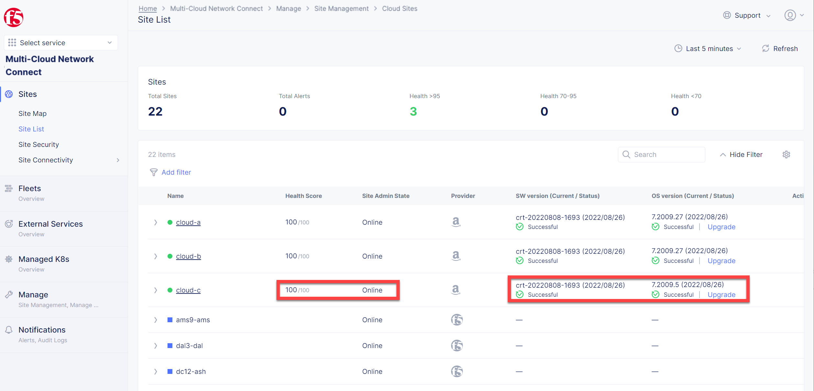

Lab 1: Deploy Terraform Resources in Cloud C
============================================

.. contents:: Table of Contents

In this lab we will use Terraform scripts to deploy resources in Cloud C for AWS. This will include AWS infrastructure and an F5 XC node deployed as type "AWS VPC Site". But first, we need to configure our third cloud (Cloud C).

> *It is recommended that for Cloud C you use a provider different from the one you've configured for Cloud A. However, we will use AWS for Cloud C since the F5 UDF environment only has AWS permissions.*

Deploy Terraform
################

1. Return to the jumphost terminal within the xRDP session, ensuring you are in the following directory /home/ubuntu/f5xc-mcn-TechXchange/.

.. code:: bash

    # check current directory
    pwd

    # example output
    /home/ubuntu/f5xc-mcn-TechXchange/

    # if output is different, then change path
    cd /home/ubuntu/f5xc-mcn-TechXchange/

> *Note: If you closed terminal windows, you need to export the VES_P12_PASSWORD environment variable again. Otherwise Terraform will fail "Error: Creating new Volterra APIClient: Building client: Creating configuration from options: Both P12Bundle() and Cert()/Key() are empty, invalid combination".*

.. code:: bash

    # example
    export VES_P12_PASSWORD=your_certificate_password

2. Deploy the Terraform code for "Cloud C" by running the script **./cloud-C-setup.sh**.

.. code:: bash

    ./cloud-C-setup.sh

3. Open F5 Distributed Cloud Console and navigate to the **Multi-Cloud Network Connect** tab.

.. figure:: ../assets/xc/cloud_a_sites.png

4. Open **Site List** and check the **Health Score**. It may take some time to provision the node.

Next Steps
##########

- `Lab 2: Create Global Network <lab2.rst>`_
