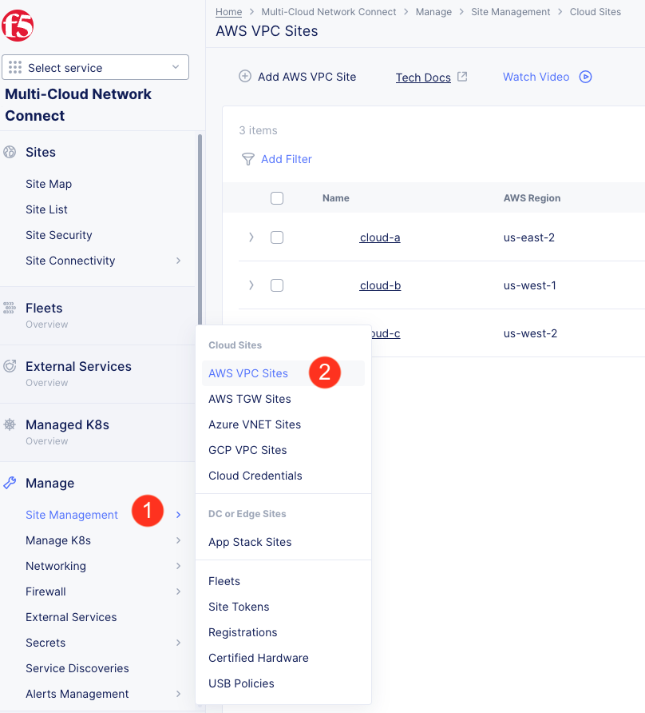
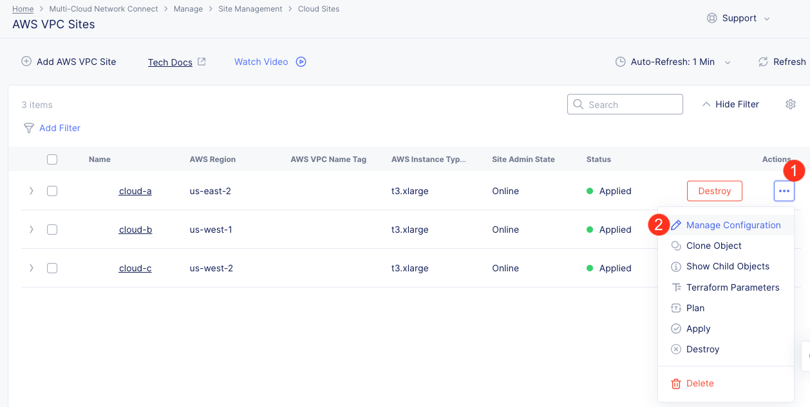
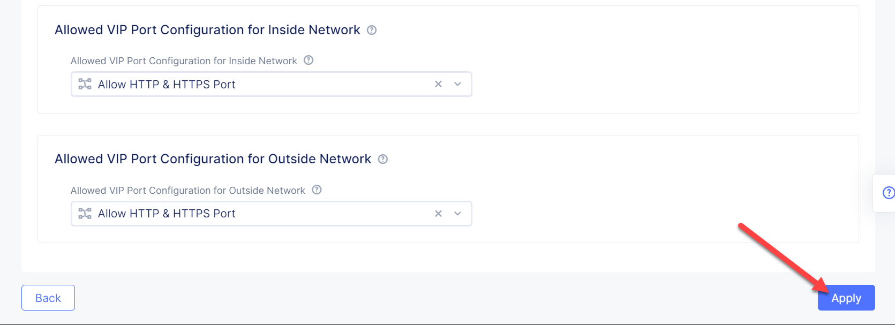
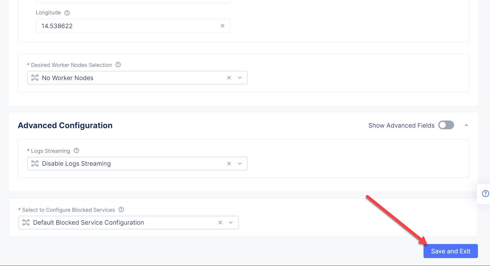

Lab 2: Create Global Network
============================

.. contents:: Table of Contents

In this module we will connect the Arcadia Core app (back-end service) to another apps service: The Transaction Module. We will use a different approach from the previous module, by using the Layer 3 connectivity via F5 Distributed Cloud Multi-Cloud Networking via Sites/Global Network.

At the end of this module, we will have the following architecture for our app services:

.. figure:: ../assets/layer-3.png

Review Global Network
#####################

Assuming you now have your Cloud C confirmed, let's move on to configure a Global Network. For automation purposes, this demo already created the Global Network object "<lastname>-global-techxhange" with Terraform code. Your task will be to associate Cloud A and Cloud C with the Global Network.

First validate the existing Global Network object. This way, you can see how it was created and the different properties.

1. Open the service menu and proceed to **Multi-Cloud Network Connect**.

.. figure:: ../assets/cloud_c_aws_1.png

2. In **Networking** select **Virtual Networks**.

3. Open the menu of your Global Network and select **Manage Configuration**.

4. Notice the type is set to Global Network. Click **Edit Configuration** to see more properties.

5. Review the additional fields and then click **Cancel and Exit**.

Update Global Network with Cloud A
##################################

Now it's time to connect Cloud A and Cloud C together by associating the sites with the Global Network. First, configure Cloud A.
 
1. In **Site Management** select **AWS VPC Sites** to see the site created. 

2. Open the menu of Cloud A site and select **Manage Configuration**.

3. In order to enable the editing mode, click **Edit Configuration**.

.. figure:: ../assets/cloud_c_aws_4.png

4. Scroll down to the **Networking Config** and click **Edit Configuration**. 

.. figure:: ../assets/cloud_c_aws_5.png

5. If needed, enable **Show Advanced Fields**, select "Connect Global Networks", and click **Add Item**.

.. figure:: ../assets/cloud_c_aws_6.png

6. Open the list of networks and select your Global Network. Then add it by clicking **Apply**.

7. Apply the updated configuration to the Site by clicking **Apply** again.

8. Review the final configuration click **Save and Exit**.

Update Global Network with Cloud C
##################################

Now we will add the Global Network to Cloud C. We can do this connectivity since there is non-overlapping IP space. If you recall, Cloud A is configured with 10.0.0.0/16 CIDR, and Cloud C is configured with 192.168.0.0/16 CIDR.

1. Open the Cloud C site menu and select **Manage Configuration**.

2. In order to enable the editing mode, click **Edit Configuration**.

3. Scroll down to the **Networking Config** and click **Edit Configuration**. 

.. figure:: ../assets/cloud_c_aws_5.png

4. If needed, enable **Show Advanced Fields**, select "Connect Global Networks", and click **Add Item**.

.. figure:: ../assets/cloud_c_aws_6.png

5. Open the list of networks and select your Global Network. Then add it by clicking **Apply**.

6. Apply the updated configuration to the Site by clicking **Apply** again.

7. Review the final configuration click **Save and Exit**.

Update Routes in Cloud A
########################

Next we need to configure routing. Traffic between Cloud A and Cloud C will use the XC Global Network. This is achieved with route table entries, matching address prefixes, and setting next hop as the XC node's network interface. This demo already created a route table entry for Cloud A to reach Cloud C via the XC Global Network.

Login to Cloud A (AWS) to validate existing routes.

1. On the UDF deployment page, click the "Cloud Accounts" tab and copy the value for "Console Password". Then open the "Console URL" to login to AWS.

================  ================
Console Username  Console Password
================  ================
udf               <redacted>
================  ================

2. Change the AWS Region to match Cloud A. For this demo, you deployed to "us-east-2" US East (Ohio).

3. Navigate to VPC.

4. Select Route Tables.

5. Select the Cloud A public route table and view the Routes.

Note: The Terraform code in this demo assigns "Name" with a value of "cloud-a-public-route-table". Unfortunately, the XC node deployment also updates "Name" and changes the value. Therefore, your public route table might be named differently. If this is the case, choose the route table with "-outside" as the suffix.

Alternatively, you can re-run the Cloud A setup script to apply the correct tags and values.

.. code:: bash

     ./cloud-A-setup.sh

     # example output
     Terraform will perform the following actions:

     # aws_route_table.public will be updated in-place
     ~ resource "aws_route_table" "public" {
          id               = "rtb-0d4ebe7caae0c2ac0"
          ~ tags             = {
               "Environment"             = "cloud-a"
               ~ "Name"                    = "CGyYiprZO-outside" -> "cloud-a-public-route-table"

     Plan: 0 to add, 1 to change, 0 to destroy.
     ...snippet...

Note: Here is an example of the updated route table names after running the setup script again.

Items of importance...

==============================  =========
Destination                     Target
==============================  =========
192.168.0.0/16 << Cloud C CIDR  eni-0d64d56fe2e9bcadc << Cloud A XC node NIC ID
==============================  =========

What does this mean? Subnets in Cloud A that are associated with this route table will send 192.168.0.0/16 destination traffic to the XC node as the next hop.

Update Routes in Cloud C
########################

At this point in the lab, you validated that Cloud A has route entries to reach Cloud C. Now you need to setup similar routing in Cloud C to allow return traffic.

First, identify the target network interface (ENI) for the XC node in Cloud C.

1. Return to the AWS Console Home and navigate to EC2.

2. Select Instances.

3. Change the AWS Region to match Cloud C. For this demo, you deployed to "us-west-2" US West (Oregon).

.. figure:: ../assets/cloud_c_region.png

4. Select the XC instance "master-0", click "Networking" tab, then copy the private interface ENI ID. This will be used as the route entry "target".

5. Optionally, you can further validate the "inside" interface by selecting the ENI (click the link). Then click the "Tags" tab to see more details about this interface.

Next, you will use the ENI ID to create a route entry.

6. Navigate to VPC.

7. Select Route Tables.

8. Select the Cloud C public route table.

Note: The Terraform code in this demo assigns "Name" with a value of "cloud-c-public-route-table". Unfortunately, the XC node deployment also updates "Name" and changes the value. Therefore, your public route table might be named differently. If this is the case, choose the route table with "-outside" as the suffix.

Alternatively, you can re-run the Cloud C setup script to apply the correct tags and values.

.. code:: bash

     ./cloud-C-setup.sh

     # example output
     Terraform will perform the following actions:

     # aws_route_table.public will be updated in-place
     ~ resource "aws_route_table" "public" {
          id               = "rtb-0fdef2c59eb633906"
          ~ tags             = {
               "Environment"             = "cloud-c"
               ~ "Name"                    = "7gS4kTqtj-outside" -> "cloud-c-public-route-table"

     Plan: 0 to add, 1 to change, 0 to destroy.
     ...snippet...

9. Select "Edit Routes" to create a new route entry.

Note: Here is an example of the updated route table names after running the setup script again.

10. Click "Add route", supply details, then "Save Changes".

Items of importance...

==============================  =========
Destination                     Target
==============================  =========
10.0.0.0/16 << Cloud A CIDR     eni-05dcbec0b9eade0c4 << Cloud C XC node NIC ID
==============================  =========

11. Review the route entries.

What does this mean? Subnets in Cloud C that are associated with this route table will send 10.0.0.0/16 destination traffic to the XC node as the next hop.

Test Application
################

Now let's test the connected modules.

1. We will open the site and see that now all the modules are active, including the Transactions. 

.. figure:: ../assets/cloud_c_app.png

2. Let's now take a look at site monitoring and visibility. Navigate to **Site Connectivity** and then move on to **Site Networking**. 

The dashboard shows all the insights, including sites' status and traffic distribution. We can also see the top 10 sites and tunnels filtered using various criteria, such as data sent and / or received, throughput and others.

3. Next let's go to the **Tunnel** tab and some tunnel analytics, including status, latency, data plane reachability, throughput and drop rate. We can see that our tunnels are up and running with high connectivity.    

4. And finally, we will take a look at statistics by interface on each F5 Distributed Cloud Services node. Proceed to the **Interfaces** tab to see the site the interface refers to, its status and throughput, as well as drop rate.   

Next Steps
##########

- `Module 4: Destroy Environment and Summary <../module4>`_
